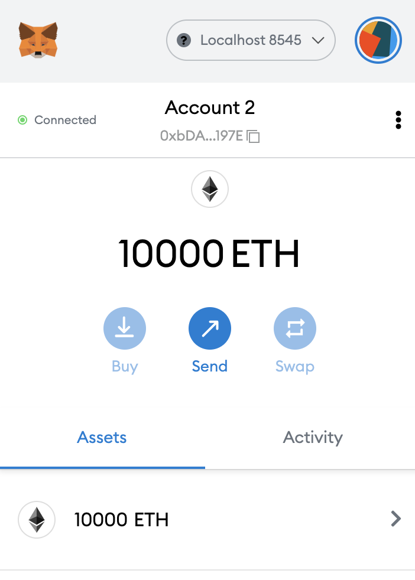

# Contracts - Local Testing

### **Setup a Hardhat project**

```shell
mkdir testing_tutorial
cd testing_tutorial
npm init --yes
npm install --save-dev hardhat

# bootstrap the hardhat project
npx hardhat

# if not on mac, you need also the below
npm install --save-dev @nomicfoundation/hardhat-toolbox
```

### **Creater Contract**

* Create**`Greeter.sol`**  inside **./contracts**

```solidity
//SPDX-License-Identifier: Unlicense
pragma solidity ^0.8.0;

import "hardhat/console.sol";

contract Greeter {
    string private greeting;

    constructor(string memory _greeting) {
        console.log("Deploying a Greeter with greeting:", _greeting);
        greeting = _greeting;
    }

    function greet() public view returns (string memory) {
        return greeting;
    }

    function setGreeting(string memory _greeting) public {
        console.log("Changing greeting from '%s' to '%s'", greeting, _greeting);
        greeting = _greeting;
    }
    
    receive() external payable{}
    fallback() external payable{}
}
```

### **Running your Local Node**

```shell
npx hardhat node
# after start we should see something like:
# Started HTTP and WebSocket JSON-RPC server at http://127.0.0.1:8545/
```

* Keep this terminal running
* Keep port used by HTTP and WebSocket JSON-RPC server
* We will use this port (8545 here) with metamask

This command starts a local blockchain node for you. You should be able to see some accounts which have already been funded by hardhat with 10000 ETH

### Set Deploy Script

* **Create/replace** ./**`scripts`**/**`deploy.js`**.

```javascript
async function main() {
  const greeterContract = await ethers.getContractFactory("Greeter");

  // here we deploy the contract
  // we provide also constructor args
  const deployedGreeterContract = await greeterContract.deploy(
    "Set by the constructor"
  );
  await deployedGreeterContract.deployed();

  // print the address of the deployed contract
  console.log("Greeter Contract Address:", deployedGreeterContract.address);
}

// Call the main function and catch if there is any error
main()
  .then(() => process.exit(0))
  .catch((error) => {
    console.error(error);
    process.exit(1);
  });

```

### **Compile and Deploy**

```shell
# If we experience Error: Cannot find module '@nomicfoundation/hardhat-toolbox', then
# npm install --save-dev @nomicfoundation/hardhat-toolbox

# from within hardhat folder
npx hardhat compile
npx hardhat run scripts/deploy.js
```

### Metamask Connection

Click on your profile and then click on settings



Then click on Networks, followed by **`Localhost 8545`**

**``**.png>)**``**

.png>)

Change the **Chain ID to `31337`**(this is the chainId for the local blockchain you are running) and then click **`Save`**

**``**.png>)**``**

* Now your MetaMask has a connection to your local blockchain&#x20;
* We will now add the accounts that Hardhat gave to us.&#x20;
* In the node terminal, you should see several accounts displayed. Let's grab one of those:

```
Account #0: 0xf39fd6e51aad88f6f4ce6ab8827279cfffb92266 (10000 ETH)
Private Key: 0xac0974bec39a17e36ba4a6b4d238ff944bacb478cbed5efcae784d7bf4f2ff80
```

* Go to **Metamask --> click on your profile --> Import Account.**&#x20;
* Select private key in the dropdown and paste the private key from the account you wish.&#x20;
* You should now see an account with 10000 ETH (wow!)

### Remix Connection

